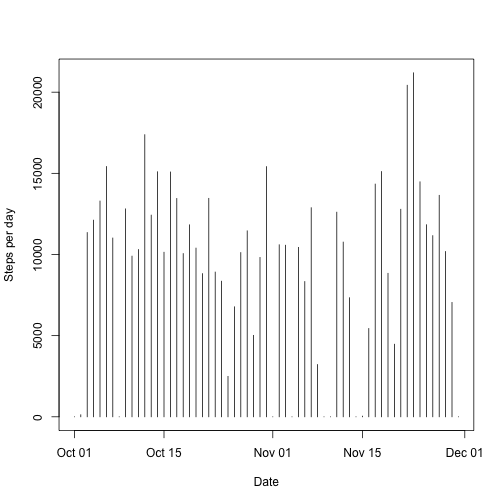
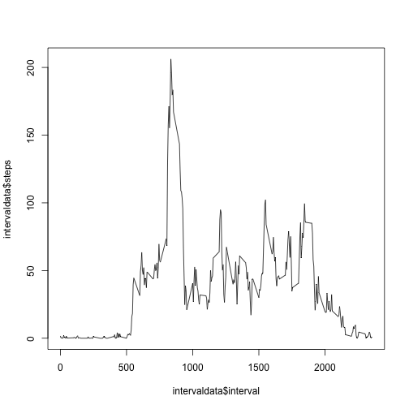

```r
## Loading and preprocessing the data
activitydata <- read.csv("activity.csv")
activitydata$date <- as.Date(activitydata$date)


## What is mean total number of steps taken per day?

#Process data to calculate
dailydata <- data.table(activitydata[,c("steps","date")])
dailydata <- dailydata[,sum(steps,na.rm=T),by="date"]
setnames(dailydata,"V1","steps")
```

#Make plot

```r
plot(dailydata$date,dailydata$steps,type="h",ylab="Steps per day",xlab="Date")
```

 

What is the mean total number of steps taken per day?


```r
#Print mean and median of daily steps
mean <- mean(dailydata$steps)
median <- median(dailydata$steps)
mean
```

```
## [1] 9354.23
```


```r
## What is the average daily activity pattern?

#Process data to calculate
intervaldata <- data.table(activitydata)
intervaldata <- intervaldata[,mean(steps,na.rm=T),by="interval"]
setnames(intervaldata,"V1","steps")
```

#Make plot

```r
plot(intervaldata$interval,intervaldata$steps,type="l")
```

 

Which 5-minute interval, on average across all the days in the dataset,
contains the maximum number of steps?

```r
# Print interval with max average steps
max(intervaldata$interval)
```

```
## [1] 2355
```

What is the total number of NA rows?

```r
## Imputing missing values

#Count NA Values
length(activitydata[is.na(activitydata$steps),"steps"])
```

```
## [1] 2304
```


```r
#Fill in data
activityest <- activitydata
for (i in 1:nrows(activityest)){
      if (is.na(activityest[i,1])) {
      int <- activityest[i,3]
      steprep <- intervaldata[interval==int][[2]]
      activityest[i,1] <- steprep
      }
}
```

```
## Error in eval(expr, envir, enclos): could not find function "nrows"
```

```r
#Process data to calculate
dailyv2 <- data.table(activityest[,c("steps","date")])
dailyv2 <- dailyv2[,sum(steps,na.rm=T),by="date"]
setnames(dailyv2,"V1","steps")
```

#Make plot

```r
plot(dailyv2$date,dailyv2$steps,type="h",ylab="Steps per day",xlab="Date")
```

 


```r
#Print mean and median of daily steps
mean(dailyv2$steps)
```

```
## [1] 9354.23
```

```r
median(dailyv2$steps)
```

```
## [1] 10395
```

```r
## Are there differences in activity patterns between weekdays and weekends?

#Processdata

activitytype <- activityest
activitytype$dow <- weekdays(activitydata$date)
activitytype$dow <- replace(activitytype$dow,activitytype$dow=="Saturday","weekend")
activitytype$dow <- replace(activitytype$dow,activitytype$dow=="Sunday","weekend")
activitytype$dow <- replace(activitytype$dow,activitytype$dow!="weekend","weekday")


#Process data to calculate
activityweek <- data.table(activitytype[,c("steps","interval","dow")])
activityweek <- activityweek[,mean(steps,na.rm=T),by=c("interval","dow")]
setnames(activityweek,"V1","steps")
```
